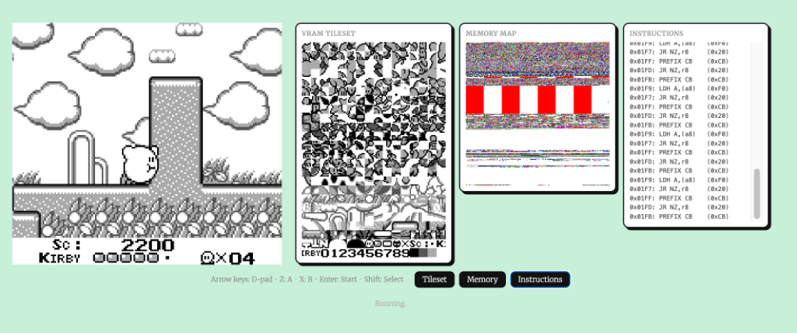

# Game Boy Emulator

A Game Boy emulator written in Rust.

I started working on this in 2023 as a hobby project, spending a couple of months on it when I had the time. I got far enough to see the Nintendo boot screen before shelving it. In 2026, I picked it back up again and used Claude Sonnet 4.6 and Gemini 3.1 Pro (High), in the Antigravity harness. They picked up where I left off and finished the CPU, GPU, and APU to the point of running full commercial games with input and sound.




## Building

### Native (SDL2)

Requires Rust and SDL2.

```bash
# macOS (Homebrew)
brew install sdl2

# Build (debug)
LIBRARY_PATH=/opt/homebrew/lib cargo build

# Build (release — much faster)
LIBRARY_PATH=/opt/homebrew/lib cargo build --release
```

### Web (WASM)

Requires [wasm-pack](https://rustwasm.github.io/wasm-pack/installer/).

```bash
# Install wasm-pack (once)
curl https://rustwasm.github.io/wasm-pack/installer/init.sh -sSf | sh

# Build the WASM package into web/pkg/
wasm-pack build --target web --out-dir web/pkg
```

Then serve the `web/` directory:

```bash
# Python 3
python3 -m http.server 8080 --directory web

# Or npx
npx serve web
```

Open `http://localhost:8080` and drop a `.gb` ROM onto the page.

The browser frontend includes optional debug views, each independently toggleable
via buttons below the game screen:

- **Tileset** — live VRAM tile viewer (128×192 px, all 384 tiles)
- **Memory** — full 64KB memory map (1 pixel per address)
- **Instructions** — scrolling log of the last 64 executed CPU instructions


## Shrimp

Shrimp is a high-level scripting language for writing Game Boy ROMs. Source files use the `.s` extension.

### Syntax quickstart

```
from core import pressed, set_sprite, Button

tile ball:
    .333....
    3333....
    33333333
    33333333
    3333....
    .333....
    ........
    ........

let bx = 80          # type inferred as u8
let vy: i8 = -1      # explicit signed type

init:
    set_sprite(0, bx, 72, ball)

on vblank:           # called every frame (~59.7fps)
    bx := bx + 1
    set_sprite(0, bx, 72, ball)
```

### Building a ROM

```bash
# Build the compiler
cargo build -p compiler --release

# Compile a .s file
./target/release/shrimp games/pong.s -o games/pong.gb
```

Then load `games/pong.gb` in the emulator (native or browser).

### Demo

`games/pong.s` — a playable Pong game in ~50 lines of Shrimp.  
Arrow keys move the paddle. The ball bounces off walls and the paddle.

### Language reference

| Construct | Example |
|---|---|
| Immutable declaration | `let x = 10` |
| Reassignment | `x := x + 1` |
| Typed declaration | `let v: i8 = -1` |
| Tile definition | `tile name: ...8 rows of 8 chars...` |
| Init block | `init: ...` |
| VBlank handler | `on vblank: ...` |
| If / elif / else | `if x > 10: ...` |
| While loop | `while x < 100: ...` |
| Function | `fn foo(a: u8): ...` |

Built-ins (imported from `core`): `pressed(Button.X)`, `just_pressed(Button.X)`,
`set_sprite(i, x, y, tile)`, `set_bg_tile(tx, ty, tile)`, `set_scroll(sx, sy)`.

## Running

### Native

```bash
# Debug build
LIBRARY_PATH=/opt/homebrew/lib ./target/debug/emulator roms/tetris.rom

# Release build
LIBRARY_PATH=/opt/homebrew/lib ./target/release/emulator roms/kirby_dream_land_game.rom
```

Place your ROM files in the `roms/` directory.

## Controls

| Key | Game Boy |
|-----|----------|
| Arrow keys | D-pad |
| `Z` | A button |
| `X` | B button |
| `Return` / `Enter` | Start |
| `Backspace` / `Shift` | Select |
| `Escape` | Quit (native only) |

## Supported Features

- **CPU**: Full LR35902 instruction set with correct flag behavior
- **GPU**: Background, Window, and Sprite (OBJ) layers; OAM DMA
- **APU**: All 4 audio channels (square ×2, wave table, noise) with envelope, sweep, and length counters
- **MBC1**: ROM bank switching (supports ROMs up to ~2MB)
- **Joypad**: D-pad and buttons via keyboard
- **BIOS**: DMG boot ROM (splash screen + header verification)
- **Timing**: VBlank-driven main loop capped at 59.7fps

## Architecture

```
src/
  cpu.rs     — LR35902 CPU: instruction table, execute/step, interrupt handling
  gpu.rs     — PPU: BG/Window/Sprite rendering, scanline timing, VBlank
  apu.rs     — APU: square wave, wave table, noise channels; stereo mixer; DC filter
  memory.rs  — Memory map, MBC1 bank switching, OAM DMA, joypad register
  main.rs    — SDL2 window + audio, frame-driven main loop (native)
  lib.rs     — WASM bindings: tick loop, keyboard input, framebuffer export
compiler/
  src/
    lexer.rs    — Shrimp tokenizer (indent/dedent tracking)
    parser.rs   — Recursive-descent parser → AST
    resolver.rs — Symbol table, WRAM layout, tile index assignment
    codegen.rs  — LR35902 code generator (label-resolved byte output)
    rom.rs      — ROM binary writer (header, tile data, layout)
    lib.rs      — compile(src) → Vec<u8> entry point
    main.rs     — shrimp CLI
web/
  index.html   — Browser frontend
  index.js     — JS glue: WASM init, render loop, keyboard, Web Audio
games/
  pong.s       — Pong written in Shrimp
```

## Notes

- `docs/` contains development notes, debugging walkthrough, and BIOS disassembly reference
- `bios/bios.rom` is required but gitignored — provide your own DMG BIOS
- `roms/` is gitignored (ROM files are copyrighted)
